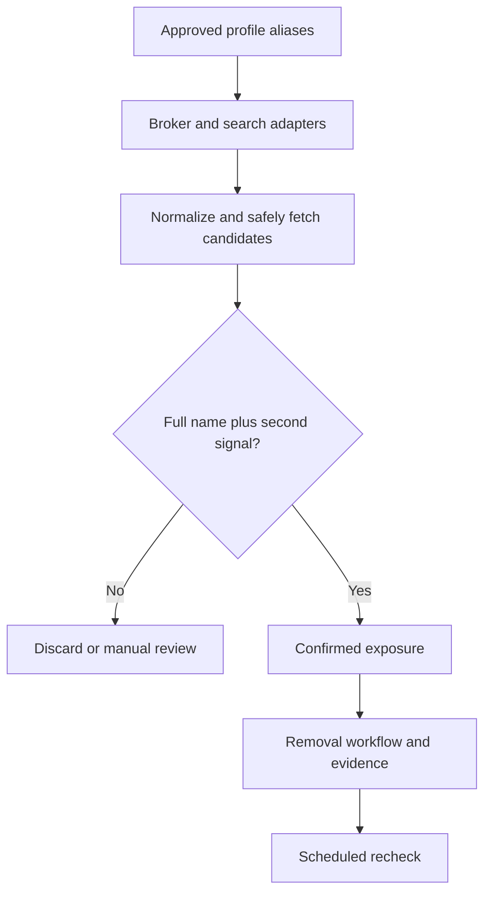

# Internet exposure discovery

Eraser treats universal privacy signals, account privacy actions, and public
internet discovery as separate layers. They have different evidence and safety
requirements.

## Layers

1. **Universal preference:** the companion extension sends GPC and legacy DNT
   on ordinary browsing requests. This communicates an opt-out preference but
   does not delete an account or remove an existing public record.
2. **Known accounts:** users can explicitly remember a site in the extension or
   import a credential-free account inventory. A future site adapter may guide
   an authenticated user to a privacy setting, but Eraser must not store the
   password or session cookie.
3. **Public exposure discovery:** broker-specific checks and approved search
   provider APIs can find public pages that may refer to the user. A result is
   not treated as a match until the full name and a second identity signal
   agree.

## Discovery pipeline

Search adapters should use supported APIs rather than scraping result pages.
Candidate fetching must block loopback, private, link-local, and metadata
addresses; limit redirects, response size, and request rate; and respect each
site's access policies. Eraser must not bypass CAPTCHAs, authentication,
paywalls, or technical access controls.

Matching should use only profile fields the user explicitly approved for the
scan. Ambiguous results remain unconfirmed and require review. Evidence should
store the minimum useful URL, match reasons, confidence, and timestamp—not a
copy of an entire page containing unrelated people's data.

## Authenticated account actions

For a remembered or imported account site, the safe workflow is:

1. Open the site in the user's browser.
2. Let the browser or password manager authenticate the user.
3. Navigate to the site's privacy controls with a site-specific adapter.
4. Preview the exact sharing opt-out or deletion action.
5. Require confirmation for destructive actions such as account deletion.
6. Record status and non-secret evidence without storing credentials, cookies,
   tokens, or page contents.

This keeps authentication inside the browser and makes the irreversible step a
user decision while still automating the repetitive navigation and tracking.
